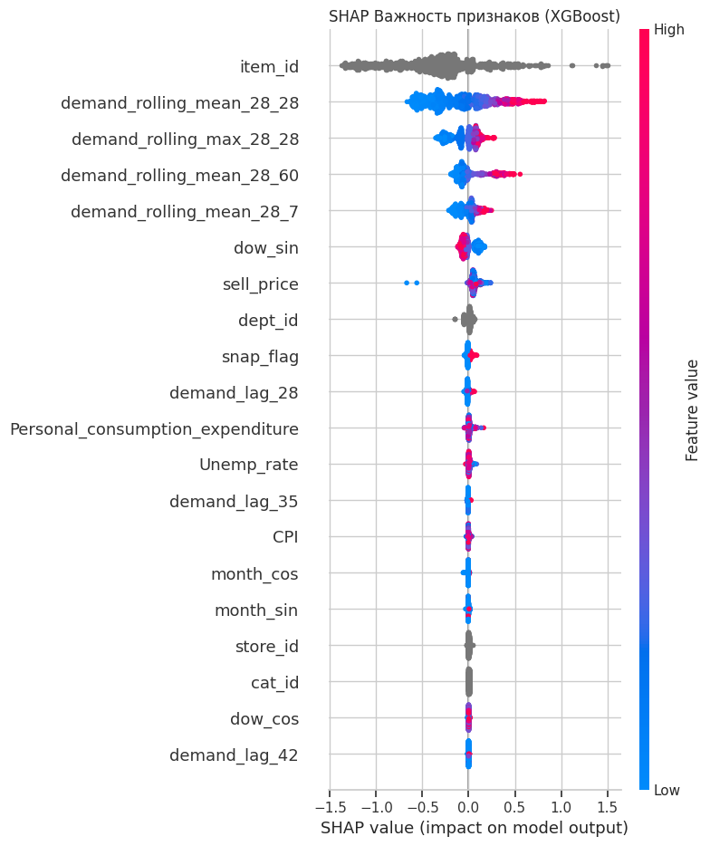
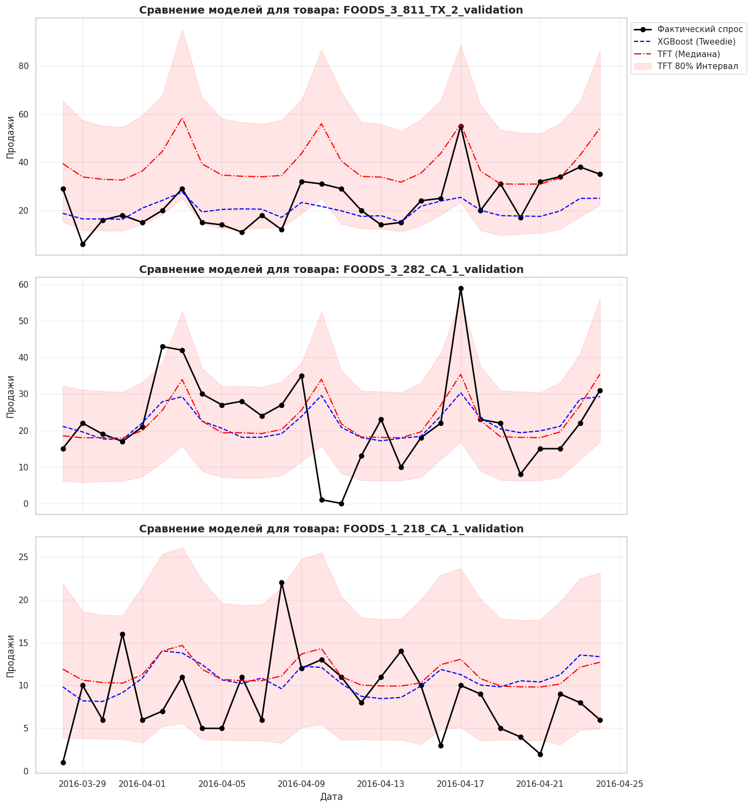
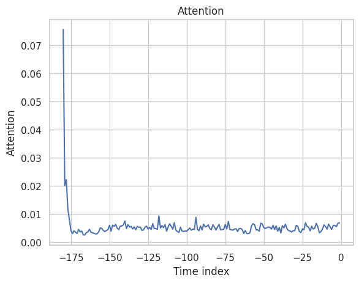
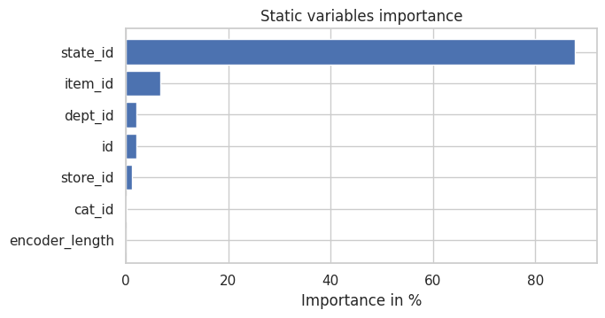
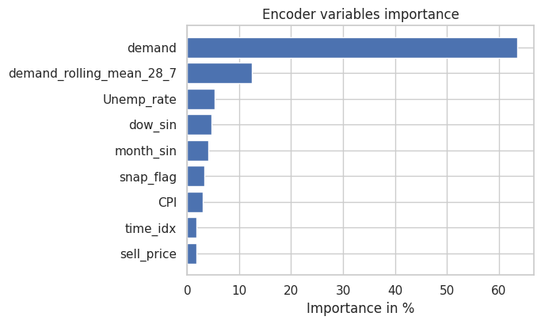

| Модель / Метрика | Значение |
|:----------------|---------:|
| **XGBoost** Tweedie WAPE (CV) | 73.60% |
| **TFT** WAPE (Медиана на Test) | 72.01% |
| **TFT** PICP (Покрытие 80% интервала) | 30.92% |

